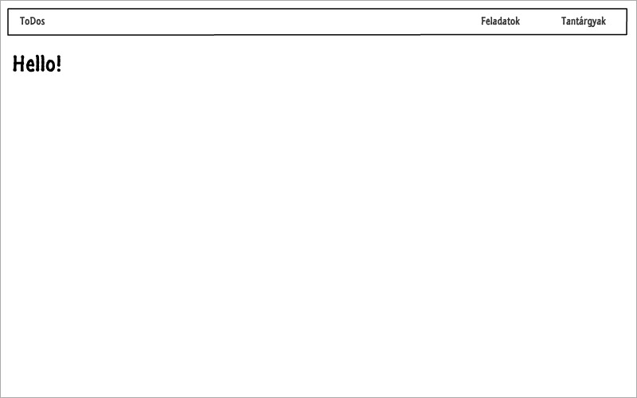
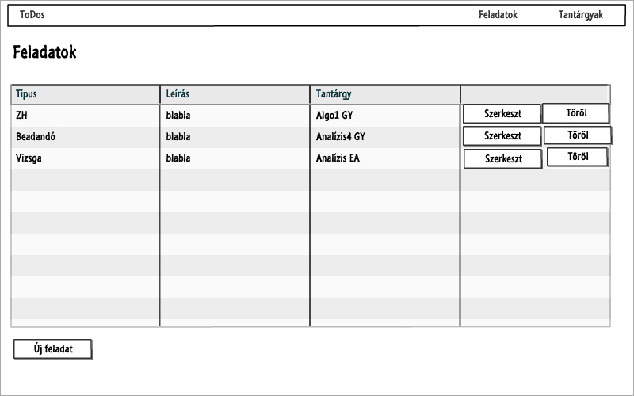
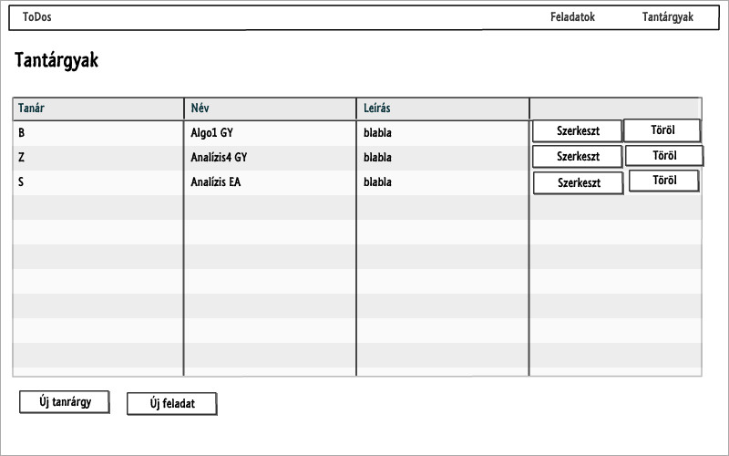
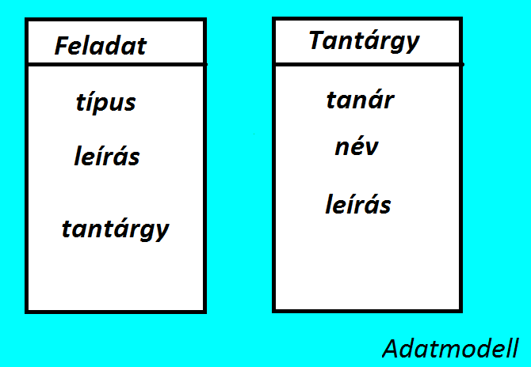
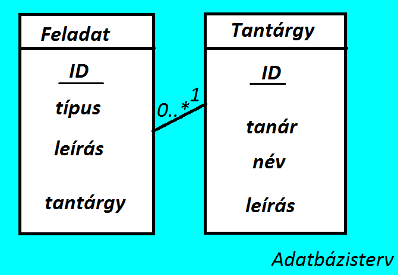
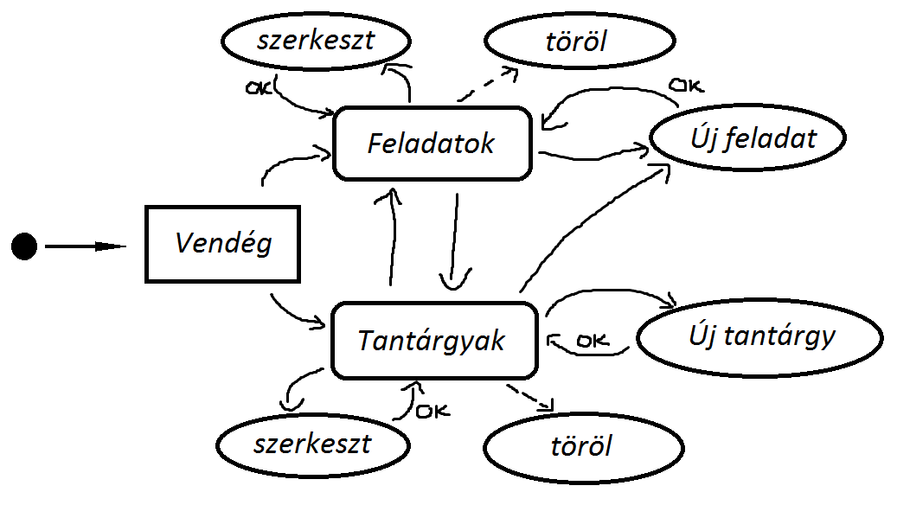

# Alkfejl_Bead3

#1) Követelményanalízis

##Funkcionális elvárások:
- Lehessen felvenni/szerkezteni/törölni tantárgyakat
- Lehessen felvenni/szerkezteni/törölni feladatokat

- Egy tantárgyhoz több feladat is felvehető.

##Nem funkcionalis elvárások:
- Használhatóság:
	legyen egyértelmű, önmagyarázó a felület
- Teljesítmény:
	a válaszidő legyen elég gyors, hogy az alkalmazás használata 	kényelmes legyen
- Rendelkezésre állás:
	szorgalmi- és vizsgaidőszakban legyen 99%-ban elérhető
- Skálázhatóság:
	a becsült felhasználó-létszám nem igényel skálázható rendszer 	tervezését kezdetben
- Biztonság:
	szükséges esetben hibajelzéssel figyelmeztetjük a felhasználót, 	hogy helyesen adja meg az adatokat
- Karbantarthatóság: 
	legyen könnyen bővíthető az alkalmazás, a megjelenés legyen 		elválasztva az adatoktól és a vezérléstől, legyen könnyű a megjelenés módosítása.		
- Vevői megszorítások: 
	az alkalmazásnak online elérhetőnek kell lennie 
	2016. január 10-től

##Használatieset-modell:

###Szerepkörök:
- vendég: 
	Az a felhasználó, aki azonosítatlanul használja az alkalmazást. A 	weben a legtöbb látogató ilyen. A vendég felhasználó csak a publikus oldalakat és funkciókat érheti el. Jelen alkalmazásban, egyenlőre minden funkciót használhat a vendég, amíg a regisztrációt be nem vezetjük.
	
##Használati eset diagram:

##Folyamatok pontos menete:
	Új feladat felvétele: 
	- Válaszd a Feladatok menüpontot, majd az Új feladat gombot. 
	- Itt töltsd ki az összes mezőt megfelelően, itt adhatod meg tantárgyat is amihez az adott feladat tartozik. 
	- Ha kész vagy nyomd meg az Ok gombot.
	- A felvett feladatot bármikor szerkezdhetet, illetve törölheted. 

#2) Tervezés:
##Architektúra terv

	- Főoldal
	- Feladatok lista
    	+ új feladat
        + feladat szerkesztése
	+ feladat törlése
	- Tantárgyak lista
	+ új tantárgy
        + tantárgy szerkesztése
	+ tantárgy törlése

	##Végpontok:
	/# index oldal
	/todos/list Feladatok lista
	/todos/edit/:id Feladatok szerkeztés
	/todos/new Új feladat felvétele
	tantargyak/list Tantárgyak lista
	tantargyak/edit/:id Tantárgyak szerkeztése
	tantargyak/new Új tantárgy felvétele

##Felhasználóifelület-modell:
###Oldalvázlatok

###Osztálymodell:

#3) Implementáció:
Fejlesztői környezet bemutatása:
	c9.io fejlesztői környezetben elkészített ember.js projekt és a hozzá kapcsolódó rest api projekt, ami 	Github kódtárban van tárolva.

##Könyvtárstruktúrában lévő mappák funkiójának bemutatása:
- bead/app/pods/components:
	-funkciók kinézete és validációja
- bead/app/pods/index:
	-bejelentkező index oldal
- bead/app/pods/tantargy
	-tantárgy modelje
- bead/app/pods/tantárgyak
	-a tantárgyhoz kapcsolódó funkciók ember.js-nek megfelelő 	template,route,controllerje
- bead/app/pods/todo
	-a todo(feladat) modelje
- bead/app/pods/todos
	-a feladatokhoz kapcsolódó funkciók ember.js-nek megfelelő 			template,route,controllerje
- bead/app/templates
	-a fejléc/menü kinézete
- bead/bower_components,config,node_modules...
	-segéd állományok, konfiguráció...

#4) Tesztelés:

1. A menü gombjai a megfelelő oldalra navigálnak
2. A feladatok oldalon:
	- látszanak a felvett feladatok
	- lehet őket szerkeszteni (kivéve a tantárgyat)
	- lehet őket törölni, törlés után nem látszik többet
	- lehet új feladatot felvenni, itt működik a validáció, addig nem 		enged tovább amíg valamelyik nincs kitöltve
3. A tantárgyak oldalon:
	- látszanak a felvett tantárgyak
	- lehet őket szerkeszteni
	- lehet őket törölni, törlés után nem látszik többet
	- lehet új tantárgyat felvenni, itt működik a validáció, addig nem 		enged tovább amíg valamelyik nincs kitöltve
	- lehet új feladatot is felvenni, ekkor a megfelelő helyre navigál

#5) Felhasználói dokumentáció:
Ez egy nagyon egyszerű webes api, regisztráció se szükséges hozzá, rögtön ki lehet próbálni. 
A fejlécben találod a menüt, válaszd ki hogy mit szeretnél látni. Ezután már látod a felvett adatokat, 
amiket szerkeszthetsz, törölhetsz és vehetsz fel újat is.

##Futtatás:
- El kell indítani a rest api-t is, különben nem látszanak az adatok (play)
- Az embert a következő paranccsal lehet futtatni a bash-ből: ./node_modules/.bin/ember serve

